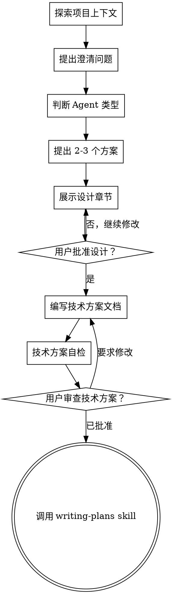

---

name: agent-design
description: "在开发或修改任何 Agent 之前必须使用本 skill，包括 LLM Agent、工具调用型 Agent、RAG Agent、多轮澄清 Agent、代码分析 Agent、自动化工作流 Agent 或多 Agent 系统。在实现之前，先通过协作式对话澄清目标、输入输出、工具边界、上下文、记忆、评估和安全约束，最终生成结构化技术方案。"
--------------------------------------------------------------------------------------------------------------------------------------------------------------------------------------

# 将 Agent 想法澄清成技术方案

通过自然的协作式对话，帮助用户把 Agent 想法逐步澄清成完整、结构化、可实现的技术方案。

先理解当前项目上下文，然后一次只问一个问题，逐步明确 Agent 的目标、边界、输入输出、工具能力、状态流转、失败处理、评估方式和实现范围。

当你理解了要构建的 Agent 后，提出 2-3 个方案，并给出推荐。
设计获得用户确认后，生成结构化技术方案文档。
技术方案文档经用户审查确认后，再进入实现计划。

<HARD-GATE>
在你提出设计并获得用户批准之前，不要调用任何实现类 skill，不要编写代码，不要创建项目结构，不要接入工具，不要修改文件，也不要执行任何实现动作。

无论 Agent 看起来多么简单，这条规则都适用。 </HARD-GATE>

## 反模式：“这个 Agent 很简单，不需要设计”

每个 Agent 都要经过这个流程。

即使只是一个简单的任务，比如修改提示词，新增字段等小功能，也必须先明确：

* Agent 的职责是什么
* Agent 不做什么
* 输入和输出是什么
* 可以调用哪些工具
* 哪些动作需要用户确认
* 如何处理失败
* 如何评估效果

简单项目的设计可以很短，但不能跳过设计。

## Checklist

你必须按顺序完成以下步骤：

1. **探索项目上下文**
   检查已有文件、文档、代码结构、现有 Agent、prompt、工具、API 和最近修改。

2. **提出澄清问题**
   一次只问一个问题，优先澄清目标、用户、输入、输出、工具边界和成功标准。

3. **判断 Agent 类型**
   判断它更适合确定性工作流、工具调用型 Agent、RAG Agent、Planner-Executor Agent，还是多 Agent 系统。

4. **提出 2-3 个方案**
   说明每个方案的取舍，并给出你的推荐。

5. **展示设计**
   按复杂度分章节展示设计，每一节后都要确认用户是否认可。

6. **编写技术方案文档**
   将用户确认后的设计保存到：

   `docs/agents/specs/YYYY-MM-DD-<agent-name>-design.md`

7. **技术方案自检**
   检查占位符、矛盾、歧义、范围失控、工具边界不清、评估缺失等问题，并内联修复。

8. **用户审查技术方案**
   要求用户审查已写好的技术方案文档。

9. **转入实现计划**
   只有用户批准技术方案后，才调用 writing-plans skill 创建实现计划。

## 流程图



**终态是调用 writing-plans。**
不要直接进入实现。agent-design 之后唯一可以进入的是 writing-plans。

## 流程说明

### 理解 Agent 想法

先查看当前项目状态，包括：

* 文件结构
* 文档
* 已有代码
* 已有 Agent 或 prompt
* 已有工具
* API 或外部系统
* 最近修改

如果用户的想法过大，例如同时包含代码分析、需求澄清、任务分发、自动改代码、通知系统和报表生成，要先指出范围过大，并帮助用户拆分。

如果项目适合继续设计，则一次只问一个问题。

优先使用多选问题，降低用户回答成本。

重点理解：

* Agent 的目标
* 目标用户
* 输入方式
* 输出形式
* 可用工具
* 工具是否有副作用
* 是否需要多轮交互
* 是否需要记忆
* 成功标准
* 失败边界

### 一次只问一个问题

每条消息只问一个问题。

不要一次问多个问题，例如：

```text
输入是什么？输出是什么？要不要记忆？要不要接工具？
```

应该拆成多轮，例如：

```text
我理解你想做的是一个帮助产品基于产品方案和现有代码提出澄清问题的 Agent。

当前最关键的是确认输入方式，因为它会影响文档解析和上下文管理。

产品方案主要会如何提交？
1. 直接在对话中粘贴或上传
2. 指定文件路径
3. 两者都支持
```

### 判断 Agent 类型

根据需求判断最合适的 Agent 类型：

* **确定性工作流**：流程稳定，规则明确，模型只负责局部理解或生成。
* **工具调用型 Agent**：需要根据任务动态搜索代码、查文档、调用 API 或读取文件。
* **RAG Agent**：需要基于知识库、文档或代码库回答。
* **Planner-Executor Agent**：任务复杂，需要先规划再执行。
* **Reflection Agent**: 当 Agent 需要对中间结果做质量检查、遗漏检测、冲突检测、重复检测，或判断是否继续探索时使用。通常是在工具调用型、RAG 或 Planner-Executor 流程中增加 Reflect / Critic 节点，而不是独立 Agent 类型。
* **ReAct Agent**: 探索型任务可以考虑，主要是由大模型决定下一步应该做什么
* **多 Agent 系统**：只有当角色确实需要拆分时才使用。

不要为了显得高级而默认使用多 Agent。

优先推荐最简单、最可测试、最可控的方案。

### 探索方案

提出 2-3 个不同方案，并说明取舍。

每个方案应说明：

* 适用场景
* 优点
* 缺点
* 风险
* 实现复杂度

最后给出你的推荐，并说明原因。

### 展示设计

当你认为已经理解要构建的 Agent 后，展示设计。

设计要分节展示，不要一次性输出过多。

每一节根据复杂度控制篇幅：

* 简单内容几句话即可
* 复杂内容最多约 200-300 字

每一节之后询问用户是否认可。

设计内容通常包括：

* Agent 目标
* 非目标
* 用户
* 输入
* 输出
* Agent 类型
* 工具边界
* 自主权限
* 人工确认点
* 上下文策略
* 记忆策略
* 控制流程
* 失败处理
* 安全约束
* 评估方案
* 实现边界

如果用户指出不合理，要回退并继续澄清。

## Agent 技术方案应包含什么

最终生成的技术方案必须是结构化的，不是随意聊天记录。

建议结构如下：

```md
# <Agent 名称> 技术方案

## 1. 背景

为什么需要这个 Agent？

## 2. 目标

这个 Agent 要解决什么问题？

## 3. 非目标

这个 Agent 明确不做什么？

## 4. 目标用户

谁会使用这个 Agent？

## 5. 使用场景

Agent 在什么场景下被触发或使用？

## 6. 输入

Agent 接受哪些输入？

例如：

- 文本
- Markdown
- PDF
- 文件路径
- 代码仓库路径
- API 数据
- 数据库记录
- 用户自然语言

## 7. 输出

Agent 输出什么？

是否需要结构化格式？

## 8. Agent 类型

选择哪种 Agent 形态？

例如：

- 确定性工作流
- 工具调用型 Agent
- RAG Agent
- Planner-Executor Agent
- 多 Agent 系统

并说明选择原因。

## 9. 核心流程

描述 Agent 从接收输入到输出结果的主流程。

## 10. 工具策略

说明 Agent 可以使用哪些工具。

每个工具说明：

- 工具名称
- 用途
- 是否只读
- 是否有副作用
- 是否需要用户确认
- 失败后如何处理

## 11. 自主边界

说明 Agent 可以自主完成什么。

## 12. 人工确认点

说明哪些动作必须经过用户确认。

## 13. 上下文策略

说明哪些信息会进入上下文。

## 14. 记忆策略

说明是否需要记忆。

如果需要，说明：

- 记什么
- 存在哪里
- 保存多久
- 如何删除或修正

如果不需要，也要明确说明。

## 15. 状态模型

如果 Agent 是多轮任务，说明状态如何流转。

## 16. 失败处理

说明常见失败场景和处理策略。

例如：

- 输入无法解析
- 工具调用失败
- 搜索结果不足
- 用户回答模糊
- 超时
- 权限不足
- 任务无法完成

## 17. 安全与权限

说明安全边界。

包括：

- prompt injection 防护
- 敏感信息处理
- 路径限制
- 只读约束
- 副作用控制

## 18. 评估方案

说明如何判断 Agent 做得好不好。

至少包括：

- 典型测试用例
- 成功标准
- 失败标准
- 工具调用准确性
- 输出质量评估

## 19. 方案对比

比较 2-3 个方案。

## 20. 推荐方案

给出最终推荐，并说明原因。

## 21. 实现边界

说明本次实现包含什么、不包含什么。

## 22. 后续实现计划入口

说明确认技术方案后，下一步进入 writing-plans。
```

## 技术方案自检

写完技术方案后，用新的视角重新检查它：

1. **占位符扫描**
   是否有 TBD、TODO、空章节、未完成描述？

2. **内部一致性**
   目标、输入、输出、工具和流程是否互相匹配？

3. **范围检查**
   是否适合进入一个实现计划？是否需要拆分？

4. **歧义检查**
   是否有需求可能被理解成两种意思？如果有，要明确选择一种或继续询问用户。

5. **工具边界检查**
   工具是否说明了只读、副作用、确认点和失败处理？

6. **自主权限检查**
   Agent 能自主做什么、不能做什么，是否清楚？

7. **评估检查**
   是否说明了如何测试和评估 Agent？

8. **安全检查**
   是否考虑 prompt injection、敏感信息、权限和副作用？

9. **模块清晰**
   每个模块是否清晰可实现，思考这个模块有模糊的地方可以深挖吗？

发现问题后直接内联修复，然后继续。

## 用户审查门禁

技术方案自检完成后，要求用户审查：

```text
技术方案已写入并提交到 `<path>`。请你审查一下。如果需要修改，我会先更新方案；如果确认无误，我再进入实现计划。
```

等待用户回复。

如果用户要求修改，就修改技术方案并重新执行自检。

只有用户明确批准后，才能进入实现计划。

## 实现阶段

用户确认技术方案后，调用 writing-plans skill 创建详细实现计划。

不要直接写代码。

不要调用其他实现类 skill。

writing-plans 是 agent-design 之后唯一的下一步。

## 关键原则

* **一次只问一个问题**
  不要用多个问题压倒用户。

* **优先使用多选问题**
  多选通常比开放式问题更容易回答。

* **先澄清，再设计**
  不要在信息不足时直接输出完整方案。

* **模块深挖到可实现**
  一个模块必须讲清楚输入、输出、核心逻辑、依赖、异常处理和验收标准后，才能进入下一个模块。技术方案要让不懂业务逻辑的小白开发者也能照着完成实现。

* **严格 YAGNI**
  不要引入不必要的复杂 Agent 架构。

* **优先简单方案**
  能用确定性流程解决的，不要上多 Agent。

* **工具必须有边界**
  每个工具都要说明用途、副作用和确认规则。

* **不要默认长期记忆**
  只有明确需要跨会话保存信息时才设计记忆。

* **必须考虑评估**
  没有评估方案的 Agent 不适合进入实现。

* **增量验证**
  分节展示设计，并在继续前获得用户确认。

* **保持灵活**
  如果用户反馈不合理，回退并继续澄清。

* **提示词完整实现**
  涉及到大模型调用提示词必须完整
